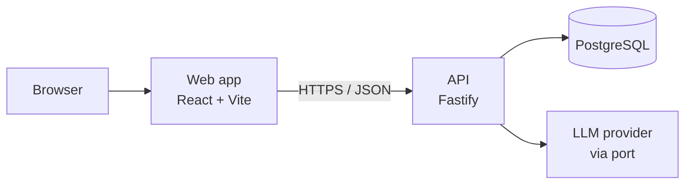

# Architecture

## What we are building

A personal calorie tracker. Users log meals, set nutrition goals, view trend reports, extract
nutrition from photos, bulk-import a PDF food diary, and do all of it through a chat assistant.

## System shape



The web app owns no business logic. Every read and write goes through the API. This is a hard
rule from the assignment, and it also makes the chat feature cheap to build (see `04-ai-design.md`).

## Layers

Each request flows through fixed layers. A layer may only call the one below it.

| Layer | Job | Touches |
|---|---|---|
| **Route** | HTTP shape: parse, validate, set status code | Zod schemas, service |
| **Service** | Business rules, orchestration, transactions | DAOs, other services, LLM port |
| **DAO** | Database access only | Prisma client |
| **Model** | Shared types and Zod schemas | nothing |

Rules that keep this honest:

- Only DAOs import the Prisma client. Services never write queries.
- Routes never talk to DAOs.
- **AI tools call services, not DAOs.** The chat assistant reuses the same service functions the
  REST routes use, so there is one implementation of "log a meal" and one set of validations.

## Directory layout

```
typeface/
├─ docs/                        # this folder
├─ progress.md                  # running decision log
├─ package.json                 # npm workspaces root
├─ tsconfig.base.json
├─ docker-compose.yml           # local Postgres
├─ .env.example                 # one env file for the whole repo
│
├─ packages/shared/src/
│  ├─ constants/                # enums, limits, micronutrient registry
│  ├─ schemas/                  # Zod: api, auth, common, nutrition, entry, goal, weight, chat, import, pagination
│  ├─ domain/                   # pure helpers (date maths, caloriesFromMacros)
│  └─ index.ts
│
├─ apps/api/
│  ├─ prisma.config.ts          # Prisma 7 CLI config (connection URL lives here)
│  ├─ prisma/
│  │  ├─ schema.prisma
│  │  └─ migrations/
│  └─ src/
│     ├─ main.ts                # process entry: start server, handle shutdown
│     ├─ app.ts                 # build Fastify instance, register plugins + modules
│     ├─ config/                # env loading and validation
│     ├─ db/                    # Prisma client + soft-delete extension
│     ├─ types/                 # Fastify type augmentation
│     ├─ modules/
│     │  ├─ health/
│     │  ├─ auth/               # routes | service | dao | guard | tokens | password
│     │  ├─ goals/
│     │  ├─ weights/
│     │  ├─ entries/
│     │  ├─ reports/
│     │  ├─ chat/
│     │  └─ ai/                 # extraction, estimation, PDF parsing
│     │     ├─ provider/        # LlmProvider port + claude / gemini adapters
│     │     ├─ prompts/
│     │     └─ tools/           # chat tool definitions -> service calls
│     └─ common/
│        └─ errors/             # AppError, error codes, error handler
│
└─ apps/web/
   ├─ vercel.json               # SPA rewrite
   └─ src/
      ├─ main.tsx
      ├─ App.tsx                # router, query client, providers
      ├─ styles/index.css       # design tokens + Tailwind theme
      ├─ lib/
      │  ├─ api/                # fetch client (auth + refresh) and one file per resource
      │  ├─ dates.ts            # calendar-date helpers and range presets
      │  ├─ format.ts           # number, unit and label formatting
      │  └─ queryKeys.ts        # cache keys and invalidation families
      ├─ components/
      │  ├─ ui/                 # Button, Field, Card, Modal, Toast, StatTile, Pagination, ...
      │  ├─ charts/             # palette, ChartCard, tooltip, DataTable, EndpointLabel
      │  └─ layout/             # AppShell, PageHeader, ThemeToggle
      └─ features/              # auth | dashboard | entries | goals | weights | reports
                                # each with its own queries.ts and components
```

A module folder is self-contained: routes, service, DAO. Adding a feature means adding a folder,
not editing five shared files. Entity schemas live in `packages/shared` instead, because the web
app needs them too; request-shape schemas that only the API cares about stay with their module.

Types are inferred from their Zod schemas with `z.infer` rather than declared separately, so a
shape and its type cannot drift apart. The one `types/` folder holds Fastify's module
augmentation, which has to be a declaration file.

## Stack

| Concern | Choice | Reason |
|---|---|---|
| Repo | npm workspaces | Zod schemas written once in `packages/shared`, used by API and web. npm ships with Node, so there is no extra tool to install before `npm install` works |
| Language | TypeScript everywhere | One type system across the API boundary |
| API | Fastify + `fastify-type-provider-zod` | Fast, small, and gives OpenAPI docs from the same Zod schemas |
| ORM | Prisma | Typed client and real migration files |
| DB | PostgreSQL | Relational data with heavy date-range aggregation |
| Auth | JWT + argon2, written by us | Multi-user support is a graded feature; outsourcing it hides the work |
| Web | React + Vite | Backend is separate, so no SSR framework is needed |
| Data fetching | TanStack Query | Removes the whole client cache/loading-state layer |
| Styling | Tailwind v4, CSS-first | Semantic colour tokens drive both UI and charts, so a theme lives in one place |
| Components | Hand-rolled on Tailwind | A dozen small primitives beat a component library we would mostly override |
| Charts | Recharts | Covers all four required report types |
| Dialogs | Radix Dialog | Focus trapping, escape and aria are the parts that are easy to get subtly wrong |
| Validation | Zod | Same schema validates the API and types the frontend |
| Logging | Pino | Structured JSON logs, built into Fastify |
| Tests | Vitest, plus Fastify `inject` | HTTP-level tests against the real service layer, with no extra HTTP client dependency |
| LLM | Provider port, Claude adapter default | Vendor is swappable by env var (`04-ai-design.md`) |

## Cross-cutting concerns

**Validation.** Every request body, query string, and path param is parsed by a Zod schema at the
route boundary. Services receive already-valid data and never re-check shapes.

**Errors.** Services throw `AppError(code, message, details?)`. One Fastify error handler maps the
code to an HTTP status and the standard error envelope. Unknown errors become `INTERNAL_ERROR`
and are logged with a request id; internals are never sent to the client.

**Auth.** A 15-minute access token in the `Authorization` header plus a rotating 30-day refresh
token in an httpOnly cookie, stored hashed so logout is real. Every data table is keyed by
`user_id`, and the id comes only from the verified token, never from a request body, so one user
can never read another's rows. Details in `03-api-spec.md`.

**Pagination.** Every list endpoint uses the same `page` / `pageSize` contract and returns the same
`meta` block. The query schema, the `meta` builder and the offset helper live once in
`packages/shared/src/schemas/pagination.ts`, so the API and the web app agree by construction.

**Rate limiting.** Global limit on all routes, plus a tighter limit on the AI routes since those
cost money per call.

## Build and module format

The API and `packages/shared` compile to **CommonJS** (`module: node16`). ESM would add a `.js`
extension to every relative import in TypeScript source, which reads badly for no benefit here;
CommonJS also keeps `node dist/main.js` working with no loader flags. The web app is ESM, because
Vite bundles it.

`packages/shared` is a compiled package: it builds to `dist/` and exposes types through its
`exports` map. Consumers import the built output, so the API can be deployed as plain compiled
JavaScript with no build-time dependency on the workspace source.

The web app reads `@tracker/shared` for its Zod schemas, so a form validates against exactly the
rules the API enforces. Because that package is CommonJS, `vite.config.ts` lists it in
`optimizeDeps.include`: a linked workspace package is not pre-bundled by default, and the dev
server cannot read named exports straight out of CommonJS. Production builds are unaffected.

Routes are lazy-loaded, which keeps the charting library out of the bundle an unauthenticated
visitor downloads.

Two dependency choices follow from CommonJS. `@fastify/swagger-ui` serves the API reference instead
of Scalar, which is ESM-only and cannot be `require`d. `@node-rs/argon2` hashes passwords instead of
the `argon2` package, because it ships prebuilt binaries and so needs no native compiler in the
deployment image.

Prisma 7 notes, since both differ from older versions:

- The connection URL is **not** in `schema.prisma` any more. The CLI reads it from
  `apps/api/prisma.config.ts`, and Prisma no longer loads `.env` on its own, so that file loads it.
- The running client connects through a **driver adapter** (`@prisma/adapter-pg`), constructed in
  `src/db/prisma.ts`.

## Deployment

| Piece | Host | Notes |
|---|---|---|
| Web | Vercel | Static build, env var points at the API |
| API | Fly.io, 1 always-on machine | Free tiers that sleep give reviewers a 50-second cold start |
| DB | Neon | Managed Postgres, free tier is enough |
| Secrets | Host env vars | Nothing in the repo; `.env.example` documents every key |

The API runs from a Dockerfile so local and production behave the same. Migrations run on deploy.
Local development needs only `docker compose up -d` and `npm run dev`.
