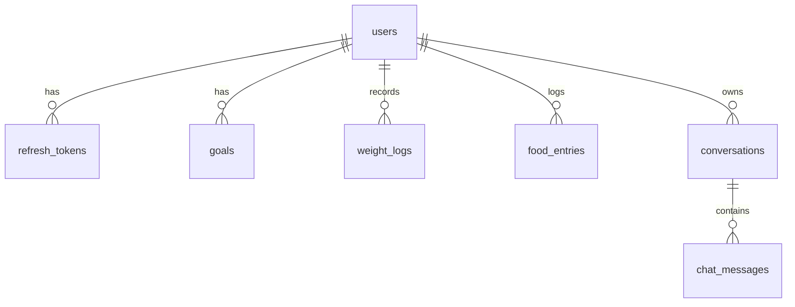

# Data model

PostgreSQL. All ids are UUIDs. Schema lives in `apps/api/prisma/schema.prisma`.



## Time in this model

**Calendar dates** — when a user ate something, when a goal starts, when a weight was taken — are
`date` columns and travel as `'YYYY-MM-DD'` strings. They are facts about a day, not instants.

**There are no audit timestamps.** No `created_at`, no `updated_at`. A column earns its place only
if code reads it, and nothing in this app reports on when a row was written. What survives is state
the app actually depends on:

| Column | Why it exists |
|---|---|
| `refresh_tokens.expires_at`, `revoked_at` | Token validity and revocation |
| `conversations.updated_at` | The chat sidebar is ordered by recency |
| `food_entries.deleted_at`, `conversations.deleted_at` | Soft delete state |

One consequence worth knowing: with no `created_at` on `food_entries`, insertion order is not
recoverable. List queries therefore end on `id` as a final sort key — without a unique last key,
offset pagination can repeat or skip rows whose sort values tie. Within one meal on one day the
resulting order is arbitrary but stable, which is all pagination needs.

Keeping dates and instants apart buys two things:

- **Backfilling works by default.** A user logging yesterday's lunch, or importing a year of
  history, is an ordinary insert. If "when was this eaten" were a creation timestamp, every
  historical entry would land on the day it was typed in.
- **There is no timezone handling anywhere.** A date has no instant to convert, so nothing can be
  off by a day, and no endpoint takes a `tz` parameter. Helpers in
  `packages/shared/src/domain/dates.ts` are the only place the two representations meet.

Nutrition values and weights are `double precision` (Prisma `Float`), not `Decimal`. They are
measurements, not money, and error over a month of sums is far below one calorie. `Decimal` would
force a conversion in every DAO and every JSON response for no gain. Daily calorie targets are
`Int`, because nobody sets a goal of 2200.5.

## users

| Column | Type | Notes |
|---|---|---|
| id | uuid | PK |
| email | text | unique, stored lowercased |
| password_hash | text | argon2id |
| name | text | |

No soft delete: there is no account-deletion feature. Adding one later means adding `deleted_at`
and changing the email index to a *partial* unique index, otherwise a deleted account would block
its own email from ever being reused.

## refresh_tokens

| Column | Type | Notes |
|---|---|---|
| id | uuid | PK |
| user_id | uuid | FK users, cascade |
| token_hash | text | unique, SHA-256 of the token |
| expires_at | timestamptz | |
| revoked_at | timestamptz | nullable |

- Index: `(user_id)` — used to revoke every session for a user at once

Stored server-side so that logout actually invalidates a session. A stateless refresh JWT would
stay valid until it expired, which makes a logout button decoration.

Only the **SHA-256 hash** is kept, so a database leak cannot be replayed. A fast hash is correct
here: these are 384 bits of randomness, and argon2 exists to slow down guessing of low-entropy
passwords. There is nothing to guess.

Tokens **rotate** on every refresh: the old row is revoked and a new one issued in one transaction.
If a revoked token is ever presented again, that looks like a stolen cookie, so every session for
that user is revoked and they must log in again.

## goals

Goals are **versioned, not edited**. Changing a target inserts a new row with a later
`effective_from`.

Why: a goal-vs-actual chart for last month must compare against the goal that was active *then*.
Overwrite one row and every past comparison silently changes the moment a user edits a target.

| Column | Type | Notes |
|---|---|---|
| id | uuid | PK |
| user_id | uuid | FK users, cascade |
| daily_calories | int | |
| protein_g / carbs_g / fat_g | float | daily targets |
| target_weight_kg | float | nullable |
| effective_from | date | the day this version starts applying |

- Unique: `(user_id, effective_from)` — one version per day
- Index: `(user_id, effective_from desc)`

### Resolving the goal for a day

```
goal(day) = latest version where effective_from <= day
          ?? earliest version the user has
```

The fallback matters because of imports. Historical meals routinely predate any goal the user ever
set, and a chart with a missing target line looks broken. Comparing against their earliest recorded
goal gives a usable baseline instead.

That comparison is a little fictional — the user had not set that target yet — so the API marks
those buckets with `goalIsBaseline: true` and the chart can render them differently. Silently
presenting a guess as a real target would be the worse choice.

Versions are few, so all of a user's goals are fetched once and resolved in memory rather than
running a correlated subquery per day.

There is **no delete**. A goal version is history, and deleting one would rewrite the past
comparisons that versioning exists to protect. Users supersede a goal, they don't remove it.
Because only changed fields are sent, the service reads the current version and merges the update
onto it before inserting the new row.

## weight_logs

This is what gives `target_weight_kg` something to compare against. Without it the target is a
dead field, because meals were the only thing a user could enter.

| Column | Type | Notes |
|---|---|---|
| id | uuid | PK |
| user_id | uuid | FK users, cascade |
| measured_on | date | one weight per day |
| weight_kg | float | |

- Unique: `(user_id, measured_on)`
- Index: `(user_id, measured_on desc)`

A second weigh-in on the same day is a correction, not a new data point, so logging the same day
again **upserts** and there is no separate update operation.

Hard delete, not soft. The unique key means a soft-deleted row would permanently block that day
from being logged again, and no AI path deletes a weight, so nothing needs an undo.

## food_entries

| Column | Type | Notes |
|---|---|---|
| id | uuid | PK |
| user_id | uuid | FK users, cascade |
| entry_date | date | the day the user says they ate it |
| meal_type | enum | `BREAKFAST` `LUNCH` `DINNER` `SNACK` |
| food_name | text | max 120 chars |
| quantity | float | |
| unit | enum | `G` `ML` `PIECE` `SERVING` `CUP` `TBSP` `TSP` `OZ` |
| calories | float | |
| protein_g / carbs_g / fat_g | float | |
| micros | jsonb | see below, defaults `{}` |
| source | enum | `MANUAL` `IMAGE` `PDF` `CHAT` `AI_ESTIMATE` |
| deleted_at | timestamptz | nullable, soft delete |

- Index: `(user_id, entry_date desc)` — the listing and report query
- Index: `(user_id, meal_type, entry_date desc)` — meal-type filter

**Stored values are totals for the logged quantity, not per 100 g.** Two slices of bread store the
calories of both slices, so every report is a plain `SUM` with no unit maths at read time.

`entry_date` is user-chosen and required, which is why the entry form asks which day the meal was
for. Ordering within a day comes from `meal_type`: the Postgres enum sorts in declaration order,
so breakfast, lunch, dinner, snack falls out for free. No clock time is stored, because no feature
needs one — "calories by hour" is not a requirement, and asking users for a time they do not
remember is friction for nothing.

`source` is set by the server, never by the client: it records which code path created the row, so
the UI can show "added from a photo" and we can see whether the AI features actually get used.
`AI_ESTIMATE` means the user typed a food name and the model filled in the numbers.

### What `quantity` is for

Stored totals mean nothing *computes* from quantity. It is **descriptive**, and that is enough:

1. **A log line without a portion is not verifiable.** "Rice — 400 kcal" tells the user nothing
   about whether that figure is plausible. "Rice, 250 g — 400 kcal" does.
2. **It is an input to the AI features.** `POST /ai/estimate-nutrition` takes food name, quantity
   and unit, and a nutrition label is printed *per serving*, so quantity is how the model scales a
   label to what was actually eaten.

Editing quantity does **not** rescale the stored nutrition. A `PATCH` sets exactly the fields it is
given and nothing else. The tradeoff: changing 200 g to 300 g leaves the old calories in place
until the user updates them too. That is the predictable behaviour — a PATCH never changes a field
the caller did not send — and it keeps the write path free of inferred arithmetic.

## Macros as columns, micros as JSONB

`calories`, `protein_g`, `carbs_g` and `fat_g` are real columns because we aggregate them and
compare them against goals constantly.

Micronutrients are a long, mostly-empty list — a banana has no vitamin D on its label. Twenty-five
nullable columns would be mostly nulls, and an EAV table would turn every report into a pivot. One
`jsonb` column stays simple, and a shared Zod schema stops it becoming a junk drawer.

`micros` keys (all optional, all non-negative numbers, the unit is part of the key name):

```
vitamin_a_mcg, vitamin_c_mg, vitamin_d_mcg, vitamin_e_mg, vitamin_k_mcg,
thiamin_mg, riboflavin_mg, niacin_mg, vitamin_b6_mg, folate_mcg, vitamin_b12_mcg,
calcium_mg, iron_mg, magnesium_mg, phosphorus_mg, potassium_mg, sodium_mg,
zinc_mg, copper_mg, selenium_mcg,
fiber_g, sugar_g, saturated_fat_g, trans_fat_g, cholesterol_mg
```

The schema is `strict`, so an unknown key is rejected at the API boundary and the LLM cannot invent
`vitaminC` or `vit_c`. The key list, display labels and the adult reference daily values used by
the micronutrient report live in `packages/shared/src/constants/nutrients.ts` — one source of
truth, and the Zod schema is built from it.

## Soft delete

Only **`food_entries`** and **`conversations`** have `deleted_at`. Both need an undo path: the chat
assistant can delete entries, and AI-triggered deletes are exactly where recoverability matters.

Everything else deletes for real, each for a reason: `users` has no delete feature, `goals` are
history, `weight_logs` are keyed one-per-day so a hidden row would block that day forever, and
`chat_messages` are never removed individually.

**Reads are the risk, not writes.** One report query missing `deleted_at IS NULL` silently puts
deleted food back into a chart. So the filter is not left to each DAO — a Prisma client extension
(`apps/api/src/db/soft-delete.ts`) injects it into every `find`, `count`, `aggregate`, `groupBy`
and `update` on those two models, and **blocks** `delete`, `deleteMany` and `findUnique` with a
message saying what to use instead. `findUnique` is blocked because it cannot accept a non-unique
filter, so it would read deleted rows; every DAO scopes by `(id, user_id)` via `findFirst` anyway.

Known limit: only top-level operations pass through the extension. A nested `include` is not
filtered, so these two models are always read directly rather than through a relation.

Indexes are plain rather than partial. Partial indexes are not expressible in the Prisma schema,
and managing them as raw SQL would show up as schema drift on every migration — not worth it at
this data volume.

## PDF import stores nothing

There is no `import_jobs` table. The PDF endpoint is a pure function: upload in, candidate rows
out, nothing persisted. The browser holds the candidates in component state while the user edits
them, then posts the corrected rows to `POST /entries/bulk` — the same endpoint any other bulk
insert uses.

What this buys: no table, no status column, no lifecycle to keep in sync, and no half-finished
import rows to clean up. One implementation of "write these entries", shared with manual logging.

The tradeoff, accepted deliberately: refreshing the page mid-review loses the parse and the AI call
has to be paid for again. Import history is also gone. Both are cheap next to a table whose only
job was to hold data for a few minutes.

## conversations

| Column | Type | Notes |
|---|---|---|
| id | uuid | PK |
| user_id | uuid | FK users, cascade |
| title | text | first user message, trimmed |
| updated_at | timestamptz | bumped on each message, for sidebar ordering |
| deleted_at | timestamptz | nullable, soft delete |

- Index: `(user_id, updated_at desc)` — the sidebar is ordered by recency, so `updated_at` is
  bumped whenever a message is added

## chat_messages

| Column | Type | Notes |
|---|---|---|
| id | uuid | PK |
| conversation_id | uuid | FK conversations, cascade |
| seq | int | position in the thread |
| role | enum | `USER` `ASSISTANT` |
| content | jsonb | provider-neutral content blocks |
| token_count | int | nullable, from the provider's usage response |

- Unique: `(conversation_id, seq)` — doubles as the ordering index

Four decisions here, since this was the easiest part to get wrong:

**Two roles, not three.** A tool *result* is sent back to the model as a **user**-role message
containing a tool-result block. A separate `TOOL` role would have to be remapped on every replay.

**Content is provider-neutral.** Storing Claude-shaped blocks would have made every past
conversation unreplayable the moment we switched provider — which defeats the provider port in
`docs/04-ai-design.md`. The stored shape is ours:

```
{ type: 'text',        text }
{ type: 'tool_call',   id, name, input }
{ type: 'tool_result', toolCallId, output, isError }
```

Each adapter translates on the way out. Schema in `packages/shared/src/schemas/chat.ts`.

**An explicit `seq`, and no timestamp at all.** Ordering by a write time would be unsafe anyway —
an assistant turn and its tool result are written in the same millisecond and can come back in the
wrong order. A per-conversation sequence number is unambiguous, and the unique constraint makes a
gap or a collision a loud error rather than a silently scrambled transcript.

**`token_count` is stored.** History is replayed to the model every turn, which costs money, so old
turns get trimmed to a budget. With the count saved from the provider's usage response, trimming is
a `SUM` instead of re-tokenising the whole conversation on every request.

One row per message is deliberate. Splitting blocks into their own table buys nothing — a message's
blocks are always read together and never queried individually. Storing a conversation as a single
JSONB document would be worse: every new message would rewrite the whole blob, which is both slow
and unsafe under concurrent writes. Append-only rows avoid both.

## Cascade behaviour

Deleting a user removes their refresh tokens, goals, weight logs, food entries, conversations and
chat messages, enforced by `ON DELETE CASCADE` in the database rather than in application code.
